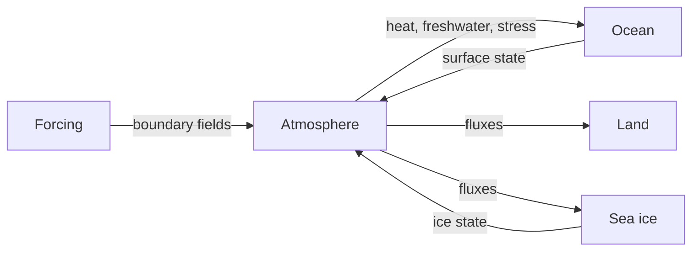
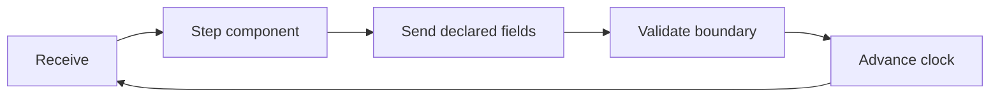
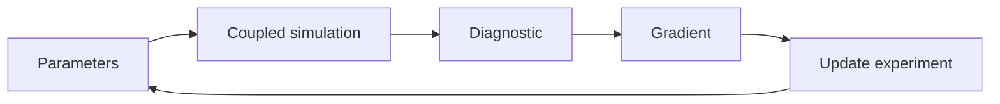
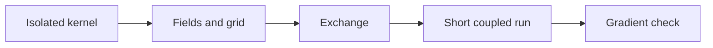

# VerCOR Developer Presentation Implementation Plan

> **For agentic workers:** REQUIRED SUB-SKILL: Use superpowers:subagent-driven-development (recommended) or superpowers:executing-plans to implement this plan task-by-task. Steps use checkbox (`- [ ]`) syntax for tracking.

**Goal:** Build and verify a 14-slide PowerPoint deck that explains VerCOR's architecture to Earth system modelers and gives developers a credible component-integration path.

**Architecture:** A focused JavaScript ES module will create the deck with `@oai/artifact-tool`, adapting selected Codex Grid layouts and using small helpers for repeated typography, notes, footers, and diagrams. Repository documentation supplies the claims; Mermaid Chart validates the four requested graph and process diagrams before the same logic is implemented as editable slide objects.

**Tech Stack:** `@oai/artifact-tool`, JavaScript ES modules, Mermaid Chart, bundled PowerPoint render and overflow tools, and the Codex Grid layout library.

## Global Constraints

- Final deck: `/Users/romannuterman/.codex/visualizations/2026/07/31/019fb77d-66d7-7290-a9b6-a653954627e8/vercor-developer-overview.pptx`.
- Build workspace: `/Users/romannuterman/Documents/Science/scodes/Python/vercor/.codex/vercor-developer-presentation`.
- Exactly 14 slides, paced for approximately 22 minutes within a 20–25 minute talk.
- Audience balance: approximately 60% architecture and integration, 25% scientific motivation, and 15% JAX/automatic-differentiation mechanics.
- Use the stable public 0.4 interface and distinguish released behavior from development-only work.
- Do not imply that host-side, mixed-backend, or output-enabled workflows are differentiable.
- Use at least 50 pt for the deck title, 35 pt for slide titles, 24 pt for subheads, and 16 pt for body text.
- Include complete speaker notes with talk track, pacing, transitions, and `[Sources]` blocks.
- Preserve the hierarchy and spacing of selected Codex Grid layouts while adapting their copy and palette.
- Create diagram connectors before nodes so edges remain behind labels.
- Render and inspect every slide; fix every unintended overlap, clipping, wrapping, and connector error.

---

### Task 1: Evidence ledger and Mermaid diagram logic

**Files:**
- Create: `.codex/vercor-developer-presentation/source-notes.txt`
- Create: `.codex/vercor-developer-presentation/diagram-notes.txt`

**Interfaces:**
- Consumes: `DESIGN.md`, `README.md`, `PROGRESS.md`, `DEPENDENCIES.md`, `docs/plugin-authoring.md`, `docs/developers/`, `docs/researchers/`, and public setup examples.
- Produces: one claim-to-source section per slide and four validated Mermaid definitions for the deck builder.

- [ ] **Step 1: Initialize the presentation workspace**

Run:

```bash
node "/Users/romannuterman/.codex/plugins/cache/openai-primary-runtime/presentations/26.730.11710/skills/presentations/container_tools/setup_artifact_tool_workspace.mjs" \
  --workspace "/Users/romannuterman/Documents/Science/scodes/Python/vercor/.codex/vercor-developer-presentation"
```

Expected: the workspace contains `node_modules/@oai/artifact-tool`.

- [ ] **Step 2: Write the slide evidence ledger**

Create `source-notes.txt` with 14 numbered sections. Each section records the
exact repository file and heading that supports every non-trivial claim on the
corresponding slide. Qualify JAX, output, CAMulator, and host-execution claims
exactly as described in `DESIGN.md` and `PROGRESS.md`.

- [ ] **Step 3: Create the four Mermaid diagrams through Mermaid Chart**

Use `mcp__codex_apps__mermaid_chart_display_mermaid` four times with these
structures:









Record the returned Mermaid definitions and document identifiers in
`diagram-notes.txt`. Expected: all four widgets render without syntax errors.

- [ ] **Step 4: Verify the evidence boundary**

Run:

```bash
rg -n "performance|speedup|benchmark|fully differentiable|CAMulator|host" \
  .codex/vercor-developer-presentation/source-notes.txt
```

Expected: no unsupported benchmark claim; differentiability and optional-model
claims are explicitly qualified.

### Task 2: Build the editable PowerPoint

**Files:**
- Create: `.codex/vercor-developer-presentation/build-vercor-deck.mjs`
- Create: `.codex/vercor-developer-presentation/rendered/`
- Create: `/Users/romannuterman/.codex/visualizations/2026/07/31/019fb77d-66d7-7290-a9b6-a653954627e8/vercor-developer-overview.pptx`

**Interfaces:**
- Consumes: Task 1 ledgers plus the selected Codex Grid modules `slide-01`, `slide-02`, `slide-04`, `slide-06`, `slide-07`, `slide-08`, `slide-10`, `slide-13`, `slide-15`, `slide-17`, and `slide-26`.
- Produces: the editable deck, per-slide PNGs and layout JSON, a montage, and an inspect snapshot.

- [ ] **Step 1: Implement deck-level helpers**

Create a plain JavaScript ES module importing `Presentation` and
`PresentationFile`. Define these interfaces without TypeScript annotations:

```javascript
function addTitle(slide, title, slideNumber, options = {}) {}
function addFooter(slide, slideNumber) {}
function addTextBox(slide, name, text, position, style = {}) {}
function addSpeakerNotes(slide, talkTrack, pacing, transition, sources) {}
function addNode(slide, name, label, position, fill, textColor) {}
function addConnector(slide, name, position, options = {}) {}
async function writeBlob(outputPath, blob) {}
```

Use a `1280 × 720` canvas, Helvetica Neue/Arial typography, off-white and white
backgrounds, deep ocean blue, atmosphere teal, land ochre, ice cyan, and coral
for constraints. Keep footer numbering consistent and titles to one line.

- [ ] **Step 2: Implement slides 1–3**

- Slide 1 adapts `slide-01`: minimal title and one-sentence promise.
- Slide 2 adapts `slide-02`: five coupling choices—fields, grids, clock,
  ordering, and boundary conventions.
- Slide 3 adapts `slide-13`: components, exchanges, runtime, and output as four
  distinct owners.

Add 1.25–1.75 minutes of notes per slide and cite `README.md` and `DESIGN.md`.

- [ ] **Step 3: Implement slides 4–6**

- Slide 4 uses the validated component graph with named field exchanges.
- Slide 5 uses the validated receive-step-send cycle and calls out run order.
- Slide 6 adapts `slide-04`: runtime responsibilities versus component-author
  responsibilities.

Create connectors before nodes. Keep diagram labels to at most four words and
cite `DESIGN.md` sections 4–7.

- [ ] **Step 4: Implement slides 7–10**

- Slide 7 adapts `slide-13`: `name`, `grid`, `spec`, and `step`.
- Slide 8 adapts `slide-08`: one compact public structural-component example,
  readable at 18 pt or larger.
- Slide 9 uses a before/after immutable payload sequence separating author
  configuration from per-run payload.
- Slide 10 uses a flat transfer diagram plus concise text for route identity,
  scalar/vector regridding, topology, masks, scheduling, and rejected ambiguous
  fan-in.

The code example may reference only public concepts from `vercor.components`,
`vercor.grids`, and `vercor.types`.

- [ ] **Step 5: Implement slides 11–14**

- Slide 11 uses the validated gradient pathway and plain-language AD copy.
- Slide 12 adapts `slide-04`: JAX-native versus host capability boundaries.
- Slide 13 adapts `slide-17`: staged integration and validation flow.
- Slide 14 adapts `slide-26`: three next actions and concise current boundaries,
  not a generic thank-you ending.

Notes on slide 11 must state that output-free JAX workflows can remain
differentiable end to end. Notes on slide 12 must distinguish compiled JAX
execution from host execution and avoid mixed-backend differentiation claims.

- [ ] **Step 6: Add notes and export artifacts**

For every slide, set visible speaker notes containing a natural talk track,
pacing, transition, and `[Sources]` block. Export each slide PNG and layout JSON,
a WebP montage, an NDJSON inspect snapshot, and the final PPTX.

- [ ] **Step 7: Run the deck builder**

Run:

```bash
cd /Users/romannuterman/Documents/Science/scodes/Python/vercor/.codex/vercor-developer-presentation
node build-vercor-deck.mjs
```

Expected: exit code 0; the final PPTX and all 14 slide previews exist.

### Task 3: Render, inspect, and refine

**Files:**
- Modify: `.codex/vercor-developer-presentation/build-vercor-deck.mjs`
- Create: `.codex/vercor-developer-presentation/qa-ledger.txt`
- Regenerate: `/Users/romannuterman/.codex/visualizations/2026/07/31/019fb77d-66d7-7290-a9b6-a653954627e8/vercor-developer-overview.pptx`

**Interfaces:**
- Consumes: Task 2 deck and previews.
- Produces: a visually corrected deck with no unintended overflow or overlap.

- [ ] **Step 1: Render the exported PowerPoint independently**

Run:

```bash
python "/Users/romannuterman/.codex/plugins/cache/openai-primary-runtime/presentations/26.730.11710/skills/presentations/container_tools/render_slides.py" \
  "/Users/romannuterman/.codex/visualizations/2026/07/31/019fb77d-66d7-7290-a9b6-a653954627e8/vercor-developer-overview.pptx"
```

Expected: 14 independently rendered slide PNGs.

- [ ] **Step 2: Create and inspect the montage**

Run:

```bash
python "/Users/romannuterman/.codex/plugins/cache/openai-primary-runtime/presentations/26.730.11710/skills/presentations/container_tools/create_montage.py" \
  --input_dir "/Users/romannuterman/.codex/visualizations/2026/07/31/019fb77d-66d7-7290-a9b6-a653954627e8/vercor-developer-overview" \
  --output_file "/Users/romannuterman/Documents/Science/scodes/Python/vercor/.codex/vercor-developer-presentation/rendered/final-montage.png"
```

Inspect for narrative rhythm, repeated silhouettes, palette drift, and
inconsistent footer treatment.

- [ ] **Step 3: Inspect every slide at full size**

Open each of the 14 PNGs and record findings in `qa-ledger.txt` as:

```text
slide N | object or region | issue | correction
```

Correct title wrapping, clipping, small text, connector routing, label
collisions, inconsistent alignment, and blurry assets.

- [ ] **Step 4: Run overflow and unresolved-content checks**

Run:

```bash
python "/Users/romannuterman/.codex/plugins/cache/openai-primary-runtime/presentations/26.730.11710/skills/presentations/container_tools/slides_test.py" \
  "/Users/romannuterman/.codex/visualizations/2026/07/31/019fb77d-66d7-7290-a9b6-a653954627e8/vercor-developer-overview.pptx"
rg -ni "lorem|placeholder|TODO|TBD|undefined|NaN" \
  .codex/vercor-developer-presentation/rendered \
  .codex/vercor-developer-presentation/inspect.ndjson
```

Expected: no overflow errors and no unresolved content.

- [ ] **Step 5: Regenerate until clean**

Repeat Task 2 Step 7 and Task 3 Steps 1–4 after each correction. Stop only when
the independent render, the 14 full-size inspections, and automated checks are
clean.

### Task 4: Record and verify delivery

**Files:**
- Modify: `PROGRESS.md`
- Verify: `/Users/romannuterman/.codex/visualizations/2026/07/31/019fb77d-66d7-7290-a9b6-a653954627e8/vercor-developer-overview.pptx`

**Interfaces:**
- Consumes: Task 3 final deck and QA evidence.
- Produces: the final handoff and a concise project-memory entry.

- [ ] **Step 1: Update project progress**

Add a dated `Current Status` entry recording the 14-slide developer deck, its
Mermaid diagrams, speaker notes, independent render, full-slide inspection,
and successful overflow/content checks. Do not claim application-code changes.

- [ ] **Step 2: Run repository checks required before commit**

Run:

```bash
git diff --check
env CONDA_NO_PLUGINS=true conda run -n scipy pytest tests/ -q --fast -n4 \
  --dist=loadscope --max-worker-restart=0 --durations=25 --tb=short
```

Expected: both commands exit 0.

- [ ] **Step 3: Commit the plan and progress record**

Run:

```bash
git add docs/superpowers/plans/2026-07-31-vercor-developer-presentation.md PROGRESS.md
git commit -m "docs: record VerCOR developer presentation"
```

- [ ] **Step 4: Verify the final artifact**

Confirm exactly 14 slides, speaker notes on all 14 slides, a readable file size,
and a clean `git status --short`. Deliver only the final PPTX, with a concise
summary of its architecture, integration, JAX/AD, and validation coverage.
