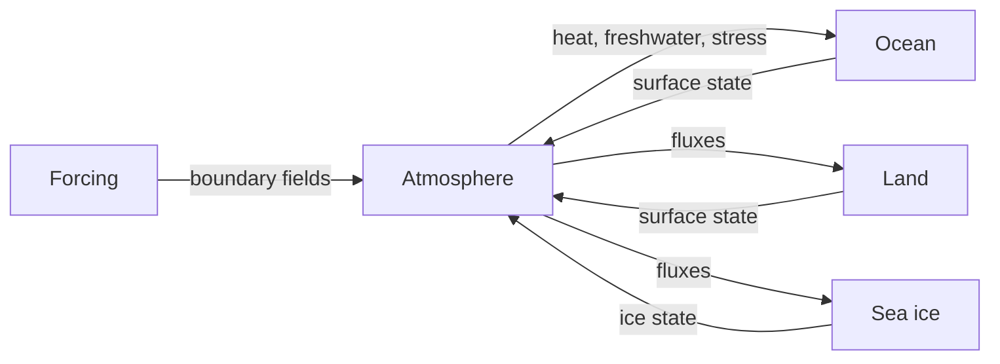
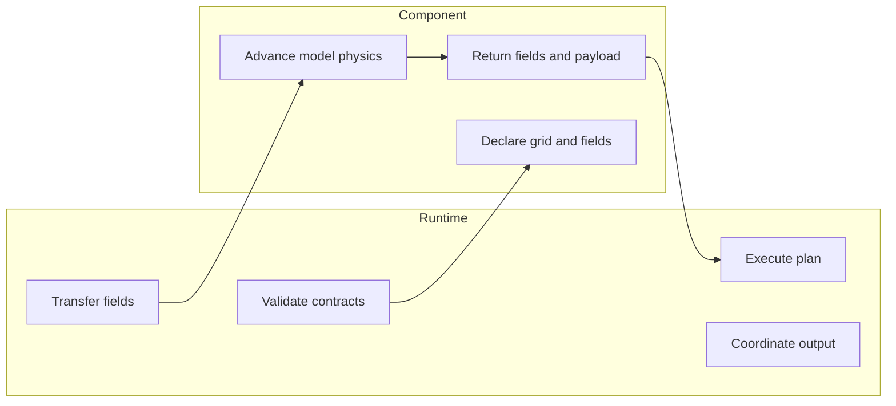
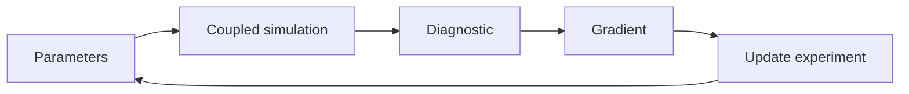
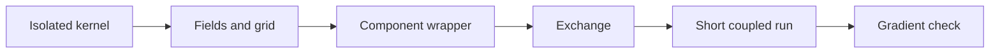

# VerCOR One-Hour Developer Presentation Implementation Plan

> **For agentic workers:** REQUIRED SUB-SKILL: Use superpowers:subagent-driven-development (recommended) or superpowers:executing-plans to implement this plan task-by-task. Steps use checkbox (`- [ ]`) syntax for tracking.

**Goal:** Create and visually verify an editable one-hour PowerPoint deck that explains VerCOR's architecture, component-integration path, and JAX/automatic-differentiation boundaries to Earth system model developers.

**Architecture:** Build the deck from repository-backed evidence using the Codex Grid layout library as the composition reference. Validate five graph and process structures with Mermaid Chart, implement the final editable slides with `@oai/artifact-tool`, and run both programmatic and slide-by-slide visual QA before delivery.

**Tech Stack:** JavaScript ES modules, `@oai/artifact-tool`, Mermaid Chart, bundled Codex Grid layouts, LibreOffice/Poppler rendering helpers, and presentation overflow inspection.

## Global Constraints

- Target approximately 48 minutes of prepared content plus 12 minutes of questions.
- Produce approximately 22 slides following the approved four-act narrative.
- Use only stable public VerCOR 0.4 interfaces in visible examples.
- Distinguish published VerCOR `0.4.3` behavior from development-only setup-gallery work.
- Qualify differentiability as applying to output-free JAX workflows; do not claim that output-enabled, host-side, or mixed-backend execution is differentiable.
- State that compiled execution requires stable payload PyTree structure, leaf shapes, and dtypes.
- Treat physics values as traced inputs and precision/execution policy as static configuration.
- Describe CAMulator compatibility as optional and not currently pinned.
- Make no unsupported performance or scalability claims.
- Use at least 50 pt for the deck title, 35 pt for slide titles, 24 pt for subheads, and 16 pt for body text.
- Add a complete talk track, pacing, transition, and `[Sources]` block to the notes of every substantive slide.
- Create/edit the PowerPoint only with `@oai/artifact-tool`; do not use `python-pptx`.
- Use Mermaid Chart to validate the five requested graph/flow structures.
- Keep final PowerPoint diagrams editable; use connectors behind nodes and keep labels concise.
- Render and inspect every slide at full size before delivery.
- Deliver only the final `.pptx`; keep plans, ledgers, renders, and source modules under the build workspace.

## File Structure

- Create `.codex/vercor-one-hour-developer-presentation/source-notes.txt` — claim-to-repository evidence ledger for all 22 slides.
- Create `.codex/vercor-one-hour-developer-presentation/diagram-notes.txt` — validated Mermaid definitions and returned document identifiers.
- Create `.codex/vercor-one-hour-developer-presentation/deck-content.txt` — final audience-facing copy, notes, pacing, transitions, and source blocks.
- Create `.codex/vercor-one-hour-developer-presentation/build-vercor-deck.mjs` — single-responsibility deck builder and exporter.
- Create `.codex/vercor-one-hour-developer-presentation/rendered/` — per-slide PNG and layout outputs, montage, and inspect snapshot.
- Create `.codex/vercor-one-hour-developer-presentation/qa-ledger.txt` — slide-by-slide visual findings and corrections.
- Create `/Users/romannuterman/.codex/visualizations/2026/07/31/019fb7ec-90d1-7403-8e23-9d1f0cd59714/vercor-developer-architecture-and-integration.pptx` — final editable deck.

---

### Task 1: Establish the evidence, content, and diagram contracts

**Files:**
- Create: `.codex/vercor-one-hour-developer-presentation/source-notes.txt`
- Create: `.codex/vercor-one-hour-developer-presentation/deck-content.txt`
- Create: `.codex/vercor-one-hour-developer-presentation/diagram-notes.txt`

**Interfaces:**
- Consumes: `DESIGN.md`, `README.md`, `PROGRESS.md`, `DEPENDENCIES.md`, `docs/plugin-authoring.md`, `docs/developers/`, public examples, and public API docstrings.
- Produces: one evidence section and one complete content record per slide, plus five syntax-valid Mermaid diagrams for the deck builder.

- [ ] **Step 1: Create the presentation workspace**

Run:

```bash
node "/Users/romannuterman/.codex/plugins/cache/openai-primary-runtime/presentations/26.730.11710/skills/presentations/container_tools/setup_artifact_tool_workspace.mjs" \
  --workspace "/Users/romannuterman/Documents/Science/scodes/Python/vercor/.codex/vercor-one-hour-developer-presentation"
```

Expected: the workspace contains a resolvable `node_modules/@oai/artifact-tool` installation.

- [ ] **Step 2: Write the slide evidence ledger**

Create `source-notes.txt` with 22 numbered sections. Record the exact repository file and heading supporting every non-trivial claim. Use this source map:

```text
01-04: README.md; DESIGN.md sections 1-3
05-07: DESIGN.md sections 4-7; docs/developers/concepts.rst; docs/developers/coupling.rst
08-10: DESIGN.md sections 2 and 4; docs/plugin-authoring.md; docs/developers/jax-components.rst; vercor/setups/gallery/custom_component_wrapping.py
11-13: DESIGN.md sections 3, 4, and 6; docs/developers/host-components.rst; docs/developers/data-components.rst
14-16: DESIGN.md sections 5, 7, and 8; docs/developers/coupling.rst
17-19: DESIGN.md sections 1, 3, 4, 7, and 8; README.md
20-22: AGENTS.md testing principles; DESIGN.md sections 6-9; PROGRESS.md Current Status and Durable Constraints; README.md Documentation
```

For each section, write `claim | source path | source heading | qualification`. Explicitly qualify output, host execution, compiled payload structure, published-version, and CAMulator claims.

- [ ] **Step 3: Write the complete deck content record**

Create `deck-content.txt` with exactly 22 sections using this schema:

```text
SLIDE 01
TITLE: VerCOR: differentiable coupling for Earth-system models
VISIBLE: <all audience-facing words on the slide>
NOTES: <natural presenter talk track>
PACE: <duration in minutes; total slides 01-22 equals approximately 48>
TRANSITION: <one sentence leading to the next slide>
[Sources]
- <repository path and heading>
[/Sources]
```

Use the approved slide sequence verbatim for each title unless shortening is necessary to prevent title wrapping. Keep the title slide minimal. Make slides 9 and 10 the only code-oriented slides. Make slide 22 the Q&A transition and close with the integration actions: explore a bundled setup, map a model to the four contracts, and validate one exchange path.

- [ ] **Step 4: Validate the content record against the approved boundaries**

Run:

```bash
rg -n "fully differentiable|output-enabled.*differentiat|host.*differentiat|mixed.*differentiat|speedup|benchmark|scalab|CAMulator|0\.4\.3|development-only|PyTree|dtype" \
  .codex/vercor-one-hour-developer-presentation/deck-content.txt \
  .codex/vercor-one-hour-developer-presentation/source-notes.txt
```

Expected: no absolute differentiability or unsupported performance claim; every output, host, mixed-backend, CAMulator, version, PyTree, and dtype claim includes the approved qualification.

- [ ] **Step 5: Create the Earth-system graph in Mermaid Chart**

Call Mermaid Chart with title `VerCOR Earth-system component graph` and:



Record the accepted definition and returned document identifier in `diagram-notes.txt`.

- [ ] **Step 6: Create the shared-clock cycle in Mermaid Chart**

Call Mermaid Chart with title `VerCOR shared-clock execution cycle` and:


Record the accepted definition and returned document identifier.

- [ ] **Step 7: Create the responsibility boundary in Mermaid Chart**

Call Mermaid Chart with title `VerCOR responsibility boundary` and:



Record the accepted definition and returned document identifier.

- [ ] **Step 8: Create the automatic-differentiation pathway in Mermaid Chart**

Call Mermaid Chart with title `VerCOR parameter-to-gradient pathway` and:



Record the accepted definition and returned document identifier.

- [ ] **Step 9: Create the staged-integration pathway in Mermaid Chart**

Call Mermaid Chart with title `VerCOR staged model integration` and:



Record the accepted definition and returned document identifier.

- [ ] **Step 10: Verify the evidence and content artifacts**

Run:

```bash
test "$(rg -c '^SLIDE [0-9][0-9]$' .codex/vercor-one-hour-developer-presentation/deck-content.txt)" -eq 22
test "$(rg -c '^\[Sources\]$' .codex/vercor-one-hour-developer-presentation/deck-content.txt)" -eq 22
test "$(rg -c '^```mermaid$' .codex/vercor-one-hour-developer-presentation/diagram-notes.txt)" -eq 5
```

Expected: all three commands exit 0.

### Task 2: Build the editable 22-slide PowerPoint

**Files:**
- Create: `.codex/vercor-one-hour-developer-presentation/build-vercor-deck.mjs`
- Create: `.codex/vercor-one-hour-developer-presentation/rendered/`
- Create: `/Users/romannuterman/.codex/visualizations/2026/07/31/019fb7ec-90d1-7403-8e23-9d1f0cd59714/vercor-developer-architecture-and-integration.pptx`

**Interfaces:**
- Consumes: `deck-content.txt`, `source-notes.txt`, `diagram-notes.txt`, and shortlisted Codex Grid modules `slide-01`, `slide-02`, `slide-04`, `slide-06`, `slide-07`, `slide-08`, `slide-10`, `slide-11`, `slide-13`, `slide-15`, `slide-17`, `slide-18`, and `slide-26`.
- Produces: editable PPTX, per-slide PNGs and layout JSON, a WebP montage, and an NDJSON inspect snapshot.

- [ ] **Step 1: Implement deck-level helpers**

Create a plain JavaScript ES module importing `fs`, `Presentation`, and
`PresentationFile`. Define these exact functions without TypeScript syntax:

- `addTitle(slide, title, slideNumber, options = {})` creates the one-line
  takeaway title at 48 px or larger and optionally applies a dark-slide color.
- `addFooter(slide, slideNumber)` creates the consistent right-aligned slide
  number and the thin structural rule.
- `addTextBox(slide, name, text, position, style = {})` adds a named editable
  textbox with zero line width, caller-supplied position, and a 21.33 px body
  default, equivalent to 16 pt.
- `addNode(slide, name, label, position, fill, textColor = COLORS.ink)` adds a
  named editable diagram node with centered 24 px text.
- `addConnector(slide, name, position, options = {})` adds a named connector
  with configurable arrowhead, color, width, and rotation.
- `addSpeakerNotes(slide, talkTrack, pacing, transition, sources)` assembles the
  required notes order and writes it with
  `slide.speakerNotes.textFrame.setText(notesText)`.
- `addCodeBlock(slide, name, code, position, highlights = [])` creates one
  editable monospaced textbox at 24 px or larger and applies the requested
  emphasis runs without rasterizing code.
- `writeBlob(outputPath, blob)` writes `new Uint8Array(await
  blob.arrayBuffer())` with `fs.writeFile`.
- `exportVerificationArtifacts(presentation)` writes all 22 PNGs and layout
  JSON files, the WebP montage, and the NDJSON inspect snapshot before calling
  `PresentationFile.exportPptx(presentation)`.

Use a `1280 × 720` canvas. Define `COLORS` with `ocean: #173B57`, `atmosphere: #1E8A8A`, `land: #B7833E`, `ice: #CBEFF3`, `coral: #D96C5F`, `offWhite: #F6F3ED`, `ink: #10202B`, `muted: #60717D`, and `rule: #B8BCC4`. Use Helvetica Neue with Arial fallback. Create connectors before diagram nodes.

- [ ] **Step 2: Implement slides 1-4 — motivation and ownership**

Use these layout silhouettes:

```text
01 -> slide-01 sparse stacked opening
02 -> slide-06 five-choice field
03 -> slide-11 two-sided comparison
04 -> slide-13 four-owner field
```

Slide 1 contains only the title, subtitle, and presenter-neutral context line. Slide 2 gives fields, grids, clock, ordering, and boundary conventions equal visual weight. Slide 3 contrasts embedded coupling logic with explicit contracts. Slide 4 presents components, exchanges, workflows/runtime, state/output as distinct owners without a dashboard-like card treatment.

- [ ] **Step 3: Implement slides 5-8 — architecture and runtime**

Use these visual structures:

```text
05 -> editable Earth-system graph derived from Mermaid definition
06 -> editable receive-step-send loop derived from Mermaid definition
07 -> editable runtime/component boundary derived from Mermaid definition
08 -> slide-15 public-surface orientation with six root exports and canonical extension areas
```

Name every diagram node and connector for inspection. Keep node labels to four words or fewer. Use named field labels on slide 5, one sentence about run order on slide 6, and a clear vertical dividing rule on slide 7.

- [ ] **Step 4: Implement slides 9-13 — component authoring**

Use these layout silhouettes:

```text
09 -> slide-13 four-contract field: name, grid, spec, step
10 -> slide-08 code-left / annotation-right wrapper example
11 -> slide-06 fields, shapes, dtypes, units, grid
12 -> two-state immutable payload sequence with author configuration separated above
13 -> slide-17 setup -> prefill -> validate lifecycle
```

The slide 10 example must use only public concepts and show a shortened structural component:

```python
@dataclass(frozen=True)
class OceanComponent:
    name = "OCN"
    grid: RectilinearGrid
    spec = ComponentSpec(
        inputs=("net_surface_heat_flux",),
        outputs=("sea_surface_temperature",),
        initial_fields={"sea_surface_temperature": 288.15,
                        "net_surface_heat_flux": 0.0},
    )

    def step(self, fields, context, payload=None):
        heat_capacity = 1025.0 * 3990.0 * 30.0
        tendency = fields["net_surface_heat_flux"] / heat_capacity
        return {"sea_surface_temperature":
                fields["sea_surface_temperature"]
                + tendency * context.dt_seconds}
```

Keep the code readable at 18 pt or larger. State in notes that real wrappers also declare initial fields and may use lifecycle hooks or payloads.

- [ ] **Step 5: Implement slides 14-16 — exchange, execution, and output**

Use these layout silhouettes:

```text
14 -> left-to-right transfer path plus compact constraint rail
15 -> slide-18 three-stage plan: workflow, chunk, backend/driver
16 -> slide-11 output opt-in versus output-free comparison
```

Slide 14 includes route identity, scalar/vector capability, bilinear/conservative regridding, masks/topology, and rejected ambiguous target-field fan-in. Slide 15 remains conceptual and does not expose private class names beyond stable public extension points. Slide 16 states that output-free execution performs no provider sampling, host transfer, path creation, or file I/O.

- [ ] **Step 6: Implement slides 17-19 — JAX and automatic differentiation**

Use these visual structures:

```text
17 -> slide-07 three plain-language JAX ideas: pure step, explicit PyTree state, compile repeated work
18 -> editable parameter-to-gradient loop derived from Mermaid definition
19 -> slide-10 capability comparison: JAX-native versus host-side
```

Slide 17 separates traced physics values from static precision/execution policy. Slide 18 labels the gradient as sensitivity of a diagnostic to parameters, not as a promise of calibration success. Slide 19 clearly marks JIT and end-to-end AD as JAX-native/output-free capabilities and host interoperability as a separate capability.

- [ ] **Step 7: Implement slides 20-22 — integration, validation, and close**

Use these visual structures:

```text
20 -> editable staged-integration path derived from Mermaid definition
21 -> slide-18 three validation layers: contracts, physics, gradients
22 -> slide-26 sparse close and Q&A transition
```

Slide 21 includes reference-data comparison, edge/error cases, finite differences, and forward/reverse agreement. Slide 22 closes with three concrete actions and one concise current-boundaries line; do not use a generic thank-you message.

- [ ] **Step 8: Add notes, stable object names, and exports**

For every slide, add notes in this order:

```text
<talk track>

Pacing: <minutes>
Transition: <sentence>

[Sources]
- <source path and heading>
[/Sources]
```

Export `slide-01.png` through `slide-22.png`, matching `.layout.json` files, `deck-montage.webp`, `inspect.ndjson`, and the final PPTX. The final path is:

```text
/Users/romannuterman/.codex/visualizations/2026/07/31/019fb7ec-90d1-7403-8e23-9d1f0cd59714/vercor-developer-architecture-and-integration.pptx
```

- [ ] **Step 9: Run the deck builder**

Run:

```bash
cd /Users/romannuterman/Documents/Science/scodes/Python/vercor/.codex/vercor-one-hour-developer-presentation
node build-vercor-deck.mjs
```

Expected: exit code 0; 22 PNGs, 22 layout JSON files, montage, inspect snapshot, and final PPTX exist.

### Task 3: Render, inspect, and refine the complete deck

**Files:**
- Modify: `.codex/vercor-one-hour-developer-presentation/build-vercor-deck.mjs`
- Create: `.codex/vercor-one-hour-developer-presentation/qa-ledger.txt`
- Regenerate: `/Users/romannuterman/.codex/visualizations/2026/07/31/019fb7ec-90d1-7403-8e23-9d1f0cd59714/vercor-developer-architecture-and-integration.pptx`

**Interfaces:**
- Consumes: the Task 2 deck and verification artifacts.
- Produces: a corrected final deck with no unintended overflow, overlap, clipping, unresolved content, or incoherent visual repetition.

- [ ] **Step 1: Render the exported PowerPoint independently**

Run:

```bash
python "/Users/romannuterman/.codex/plugins/cache/openai-primary-runtime/presentations/26.730.11710/skills/presentations/container_tools/render_slides.py" \
  "/Users/romannuterman/.codex/visualizations/2026/07/31/019fb7ec-90d1-7403-8e23-9d1f0cd59714/vercor-developer-architecture-and-integration.pptx"
```

Expected: 22 independently rendered slide PNGs in a sibling folder named `vercor-developer-architecture-and-integration`.

- [ ] **Step 2: Create and inspect the final montage**

Run:

```bash
python "/Users/romannuterman/.codex/plugins/cache/openai-primary-runtime/presentations/26.730.11710/skills/presentations/container_tools/create_montage.py" \
  --input_dir "/Users/romannuterman/.codex/visualizations/2026/07/31/019fb7ec-90d1-7403-8e23-9d1f0cd59714/vercor-developer-architecture-and-integration" \
  --output_file "/Users/romannuterman/Documents/Science/scodes/Python/vercor/.codex/vercor-one-hour-developer-presentation/rendered/final-montage.png"
```

Inspect the montage for narrative rhythm, repeated adjacent silhouettes, palette drift, weak hierarchy, inconsistent footer treatment, and abrupt section transitions.

- [ ] **Step 3: Inspect slides 1-11 individually at full size**

Open each independently rendered PNG at original detail. Record every finding in `qa-ledger.txt` as:

```text
slide N | object or region | issue | correction
```

Check title wrapping, clipped text, code readability, connector routing, field-label collisions, alignment, and color contrast. Apply corrections in the builder and regenerate the deck.

- [ ] **Step 4: Inspect slides 12-22 individually at full size**

Repeat the full-size inspection and ledger process. Pay particular attention to payload sequencing, lifecycle order, regridding labels, the JAX/host comparison, gradient qualifications, and whether the close remains legible and action-oriented.

- [ ] **Step 5: Run structural and unresolved-content checks**

Run:

```bash
python "/Users/romannuterman/.codex/plugins/cache/openai-primary-runtime/presentations/26.730.11710/skills/presentations/container_tools/slides_test.py" \
  "/Users/romannuterman/.codex/visualizations/2026/07/31/019fb7ec-90d1-7403-8e23-9d1f0cd59714/vercor-developer-architecture-and-integration.pptx"
rg -ni "lorem|placeholder|TODO|TBD|undefined|NaN|thank you" \
  .codex/vercor-one-hour-developer-presentation/rendered \
  .codex/vercor-one-hour-developer-presentation/inspect.ndjson
```

Expected: the overflow checker exits 0 and the unresolved-content search returns no matches.

- [ ] **Step 6: Verify slide count, notes, and source blocks**

Use the inspect snapshot and content record to verify:

```bash
test "$(rg -c '"kind":"slide"' .codex/vercor-one-hour-developer-presentation/inspect.ndjson)" -eq 22
test "$(rg -c '^\[Sources\]$' .codex/vercor-one-hour-developer-presentation/deck-content.txt)" -eq 22
test "$(rg -c '^PACE:' .codex/vercor-one-hour-developer-presentation/deck-content.txt)" -eq 22
```

Expected: all commands exit 0. Manually total `PACE` values and confirm approximately 48 minutes.

- [ ] **Step 7: Perform the final accuracy review**

Read all audience-facing text and speaker notes in order. Confirm the deck:

```text
- uses only stable public VerCOR 0.4 interfaces in visible examples;
- distinguishes published 0.4.3 behavior from development-only work;
- qualifies output-free JAX differentiation correctly;
- does not imply host or mixed-backend differentiation;
- states the stable PyTree/shape/dtype requirement;
- describes CAMulator as optional and unpinned;
- makes no unsupported performance claim;
- provides a concrete four-contract wrapper and staged validation path.
```

Correct any failure, regenerate, rerender, and repeat the affected checks.

- [ ] **Step 8: Record the final QA result**

Append this exact completion block to `qa-ledger.txt` only after every check passes:

```text
FINAL | 22 slides rendered and inspected individually | PASS
FINAL | overflow and unresolved-content checks | PASS
FINAL | notes, pacing, sources, and accuracy boundaries | PASS
FINAL | editable PPTX exported to the approved destination | PASS
```

Expected: the final PPTX is ready for delivery and all intermediate artifacts remain confined to the build workspace.
